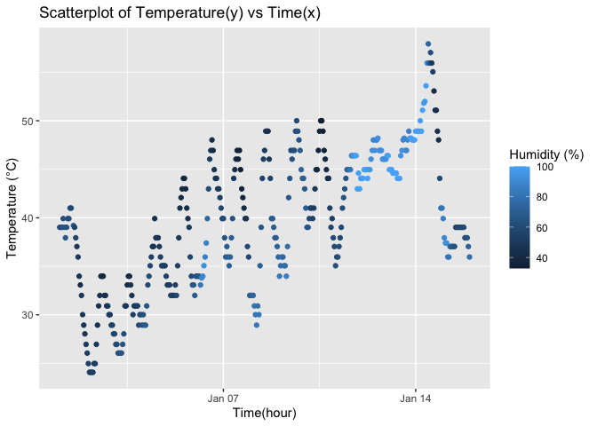

p8105_hw1_cc5424
================
ChuqiChen
2025-09-20

problem 1

``` r
library(moderndive)

library(ggplot2)

data("early_january_weather")

early_january_weather
```

    ## # A tibble: 358 × 15
    ##    origin  year month   day  hour  temp  dewp humid wind_dir wind_speed
    ##    <chr>  <int> <int> <int> <int> <dbl> <dbl> <dbl>    <dbl>      <dbl>
    ##  1 EWR     2013     1     1     1  39.0  26.1  59.4      270      10.4 
    ##  2 EWR     2013     1     1     2  39.0  27.0  61.6      250       8.06
    ##  3 EWR     2013     1     1     3  39.0  28.0  64.4      240      11.5 
    ##  4 EWR     2013     1     1     4  39.9  28.0  62.2      250      12.7 
    ##  5 EWR     2013     1     1     5  39.0  28.0  64.4      260      12.7 
    ##  6 EWR     2013     1     1     6  37.9  28.0  67.2      240      11.5 
    ##  7 EWR     2013     1     1     7  39.0  28.0  64.4      240      15.0 
    ##  8 EWR     2013     1     1     8  39.9  28.0  62.2      250      10.4 
    ##  9 EWR     2013     1     1     9  39.9  28.0  62.2      260      15.0 
    ## 10 EWR     2013     1     1    10  41    28.0  59.6      260      13.8 
    ## # ℹ 348 more rows
    ## # ℹ 5 more variables: wind_gust <dbl>, precip <dbl>, pressure <dbl>,
    ## #   visib <dbl>, time_hour <dttm>

This dataset has 358 rows and 15 columns.

It includes variables including origin, year, month, day, hour, temp,
dewp, humid, wind_dir, wind_speed, wind_gust, precip, pressure, visib,
time_hour. There are important variables such as time_hour, temperature
(°C), humidity(%), wind_speed, wind_gust. It includes hourly data from
January 1, 2023, to January 15, 2023.

The mean temperature in the dataset is 39.58°C.

``` r
ggplot(early_january_weather, aes(y = temp, x = time_hour, color = humid))+
  geom_point()+
  labs(
    title = "Scatterplot of Temperature(y) vs Time(x)",
    y = "Temperature (°C)",
    x = "Time(hour)",
    color = "Humidity (%)"
    )
```

<!-- -->

``` r
ggsave("scatterplot.pdf")
```

    ## Saving 7 x 5 in image

The x-axis represents time in hours. The y-axis represents temperature.
The color of each data point corresponds to its humidity value.

Temperature generally fluctuates upward over time. It peaks during
specific periods (near noon) and declines during evening hours. A
relationship exists between humidity and temperature, with lower
temperatures occurring at higher humidity levels.

problem 2

``` r
library(tidyverse)
```

    ## ── Attaching core tidyverse packages ──────────────────────── tidyverse 2.0.0 ──
    ## ✔ dplyr     1.1.4     ✔ readr     2.1.5
    ## ✔ forcats   1.0.0     ✔ stringr   1.5.1
    ## ✔ lubridate 1.9.4     ✔ tibble    3.3.0
    ## ✔ purrr     1.1.0     ✔ tidyr     1.3.1
    ## ── Conflicts ────────────────────────────────────────── tidyverse_conflicts() ──
    ## ✖ dplyr::filter() masks stats::filter()
    ## ✖ dplyr::lag()    masks stats::lag()
    ## ℹ Use the conflicted package (<http://conflicted.r-lib.org/>) to force all conflicts to become errors

``` r
sample1 = rnorm(10)
logical_vec = sample1 > 0
char_vec = c("A", "B", "C", "D", "E", "F", "G", "H", "I", "J")
factor_vec = factor(c("low", "medium", "high", "low", "medium", "high", "low", "medium", "high", "low"))

df = data.frame(sample1, logical_vec, char_vec, factor_vec)

mean_sample1 = mean(pull(df, sample1))
mean_sample1 
```

    ## [1] -0.1455755

``` r
#work

mean_logical = mean(pull(df, logical_vec))
mean_logical 
```

    ## [1] 0.4

``` r
#work

mean_char = mean(pull(df, char_vec))
```

    ## Warning in mean.default(pull(df, char_vec)): argument is not numeric or
    ## logical: returning NA

``` r
mean_char 
```

    ## [1] NA

``` r
#fail

mean_factor = mean(pull(df, factor_vec))
```

    ## Warning in mean.default(pull(df, factor_vec)): argument is not numeric or
    ## logical: returning NA

``` r
mean_factor 
```

    ## [1] NA

``` r
#fial
```

Taking the mean works for numeric and logical vectors, but fails for
character and factor vectors.

``` r
mean_numeric_logical = mean(as.numeric(logical_vec))
mean_numeric_logical

mean_numeric_char = mean(as.numeric(char_vec))
mean_numeric_char

mean_numeric_factor = mean(as.numeric(factor_vec))
mean_numeric_factor
```

What happens and why?

Logical to Numeric: R can change TRUE to 1 and FALSE to 0. I can take
the mean of a logical vector because they are numbers now.

Character to Numeric: Since the characters are letters, R cannot convert
them to numbers directly. So I still can not take the mean of a
character vector.

Factor to Numeric: I can take the mean of factors because factors
contains 3 different levels and R can give them different numbers. But
the original factors represent categories, not numeric values, so the
mean might not be meaningful.

Does this help explain what happens when you try to take the mean? Yes
